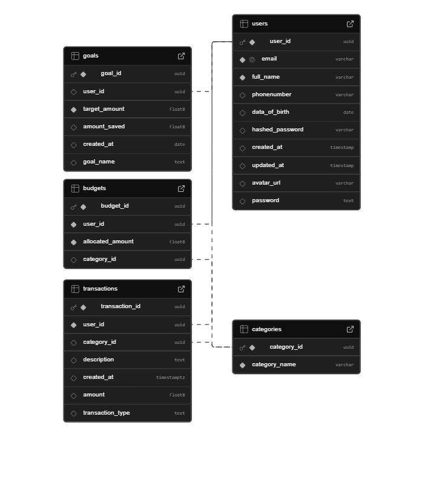

# Savvy (AI - Powered Personal Finance Management Application) 💰🤖

**Savvy** is a smart financial assistant that leverages AI and machine learning to help users save money more effectively.  
> This project was developed as part of our graduation requirements at the Faculty of Computers and Data Science.

---
## 👥 Team Members

- [**Menna Allah Saed**](https://github.com/MennaSaeed22) –  Flutter Development & Time Series Forecasting
- [**Elham Hamed**](https://github.com/elhamhamed) – Backend Development (FastAPI & Supabase)  
- [**Menna Allah Samy**](https://github.com/MennaAllahSamy) – Chatbot Model: Insights Chatbot
- [**Basmala Salama**](https://github.com/llbasmalall) – Chatbot Model: Transactions Chatbot
- [**Irinie Magued**](https://github.com/IrinieSabry) – Flutter Development

---

## 🚀 Features

- 🤖 **Smart Chatbot** with two modes:
  - **Insights** – provides smart saving tips and usage suggestions.
  - **Transactions** – auto-categorizes expenses and income.
- 📈 **Time Series Analysis** – predicts monthly expenses using LSTM.
- 💳 **Transaction Management** – add, edit, delete, and view transactions.
- 🗂️ **Budgeting by Categories** – set and track budgets for expense types.
- 🎯 **Goal Tracking** – monitor financial goals and progress.
- 📊 **Transaction Visualization** – charts and graphs to analyze spending.
- 👤 **Profile Management** – manage user info and preferences.
- 🔔 **Notifications** – reminders, alerts, and budget warnings.

---

## 🧪 How to Use
Follow these steps to run Savvy locally:
### 1. 🖥️ Backend Setup (FastAPI + Supabase)
> Prerequisites: Python 3.9+, Git, and a Supabase account.

#### 🔐 .env File Setup (`/backend/.env`)

Before running the backend, create a `.env` file in the `/backend` directory and add the following environment variables:

```env
API_KEY=your_app_api_key
SUPABASE_URL=https://your-project.supabase.co
SUPABASE_KEY=your_service_role_key

```
- SUPABASE_URL: Your Supabase project base URL
- SUPABASE_KEY: The Service Role Key from Supabase
- API_KEY: (Optional) A custom secret used to protect certain backend routes (e.g., admin endpoints). You define it manually and use it in your FastAPI code for extra security.

> - ⚠️ Do not expose the service role key or API key in frontend code.
> - ⚠️ Ensure .env is listed in .gitignore.

#### 🛠️ Supabase Configuration
Create a project at https://supabase.com

Go to Project Settings > API, and copy:
  - Project URL
  - Service Role Key

Use these in the .env file as shown above.

#### 🗄️ Database Setup
You need to manually create the required tables in your Supabase dashboard based on the project’s data model.
##### 📊 Entity Relationship Diagram (ERD)
Ensure that your Supabase tables, columns, and data types match the structure defined in the diagram. This ensures correct communication with the FastAPI backend.



> This diagram shows the structure of our database used in Supabase.

#### 🔧 Create and Activate Virtual Environment

```bash
python -m venv venv
venv\Scripts\activate
```
#### 📦 Install Requirements
In CMD, run:
```bash
pip install -r requirements.txt

```
#### 🚀 Run the FastAPI Server
In CMD, run:
```bash
python -m uvicorn app.main:app --reload --host 0.0.0.0 --port 8000

```
- --host 0.0.0.0: Makes the server accessible from other devices on the network
- --port 8000: Default port for FastAPI

#### 🌐 Access the API via Swagger UI

1- In CMD (For windows os), run:
```bash
ipconfig

```
2- Find your IPv4 Address under Wireless LAN adapter Wi-Fi.

3- Visit the Swagger UI:
```bash
http://<your-ip-address>:8000/docs

```
> This lets you test API endpoints interactively.

### 2. 🖥️ Frontend Setup (Flutter)
> Prerequisites: Flutter SDK installed, emulator or physical Android device ready.

#### 📦 Install Flutter Dependencies

In your Flutter project directory, run:

```bash
flutter pub get
```
#### ⚙️ Configure API Base URL
Update your Flutter project to use the correct backend URL depending on your testing device in (Flutter\lib\screens\globals.dart) baseURL:
- **Android Emulator:**  
```bash
http://10.0.2.2:8000/
```
- **Physical Device on same Wi-Fi:**  
```bash
http://<your-ip-address>:8000/
```

> This ensures that the app can communicate with the FastAPI backend running on your machine.

#### ▶️ Run the App
To launch the app, run:

```bash
flutter run
```
> Make sure the selected device (emulator or real device) is connected and ready.

>✅ At this point, the full Savvy system should be running:
FastAPI backend connected to Supabase + Flutter frontend consuming the API.

## 🎬 Demo

Watch a walkthrough of the **Savvy** app in action:

▶️ [Watch the Demo Video on Google Drive](https://drive.google.com/file/d/1Lmywf6zBik9U5o5n1nwP9AgltpjU85cg/view?usp=drive_link)

> The video highlights core features such as the chatbot, budgeting, predictions, and transaction management.